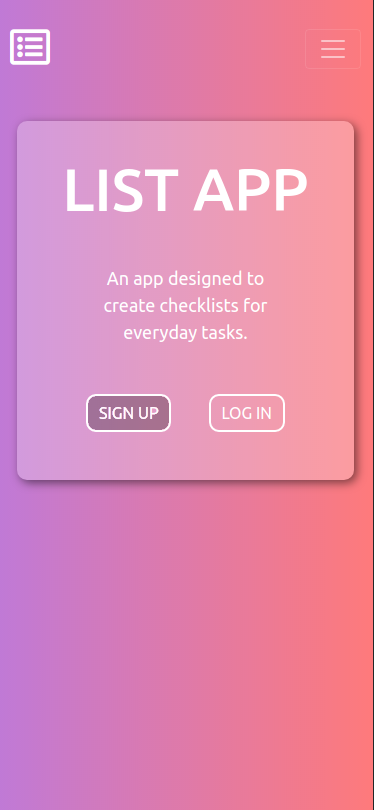
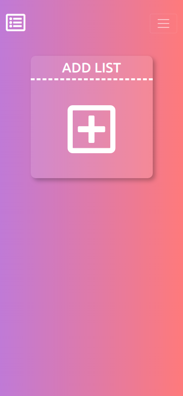

# [React-List-App](https://listapp-molina.herokuapp.com/)
MERN Stack App for shopping lists

## How to use the app
1. Signing up.
    1. Sign up for an account by clicking the Sign up button.
    2. Fill out the short form to register for an account. Then Click the Sign up button once available

    
    

2. Creating Lists.
    1. Click on the large square labeled 'ADD LIST' and it will transform into a form where you can submit the list name. 
    2. Click the add button and it will render a new box containing the list.

    
    
    

3. Adding Items to the list.
    1. Click the list box you'd like to start adding items to.
    2. You will be redirected to the list page where you can start adding items to the list.
    3. Simply type the item you'd like to add. 
    4. Change the quantity by clicking on the plus and minus buttons.
    5. Add the item by clicking on the Add button or pressing enter.

    
    

4. Removing Items from the list.
    1. Click on the item you'd like to mark as completed.
    2. When ready to remove the completed items from the list, Click the Remove Checked Items button at the bottom of the list.

    

5. Deleting a list and all items inside it.
    1. Located on the Nav bar (if on smaller screens, you can dropdown the nav bar by clicking the top right menu icon.) You will find a link to delete the list if you are inside of it.
    2. If you click the delete list link, it will redirect you back to the home page having deleted all list items and the list from the database.

    

6. Changing Account credentials
    1. Located on the Nav bar (if on smaller screens, you can dropdown the nav bar by clicking the top right menu icon.) there is a link to user settings.
    2. This link will redirect you to a new page where you can change your email, username and password. as well as delete the user account. All changes require the current password.

    